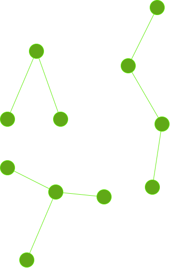
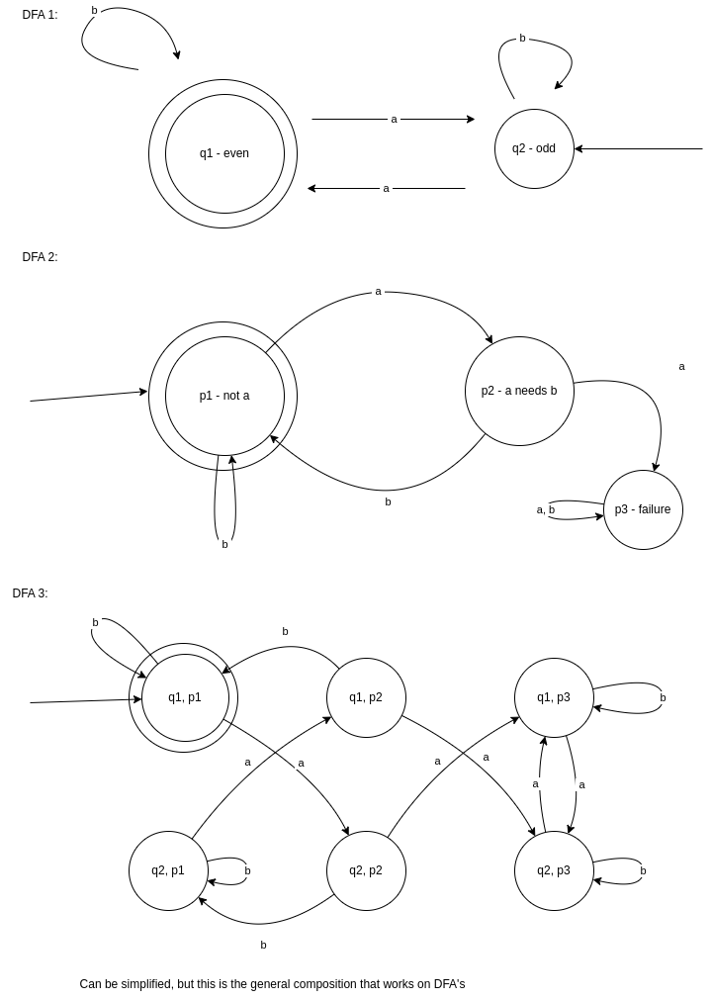

# CECS 329 02/08/2024

## Homework 1 Review 
Your tree may not just be your expectation for a tree, there are many types of trees, keep that in mind with your proof

hypothesis: any tree with less than nk nodes will have one less than the number of nodes

## Combining DFA
L = { w | w has an even number of a's AND each a is followed by at least one b }

### Larger combined machines

A concatenation machine would theoretically, check every possible split that satisfies both machines and determine when to switch from one machine to the second machine. the first machine would not longer have an accepting state as the second machine would be the only one with an accepting state. 

The string is FINITE, therefore the machine is still a Deterministic Finite Automation

