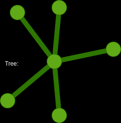
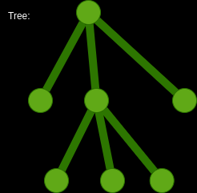
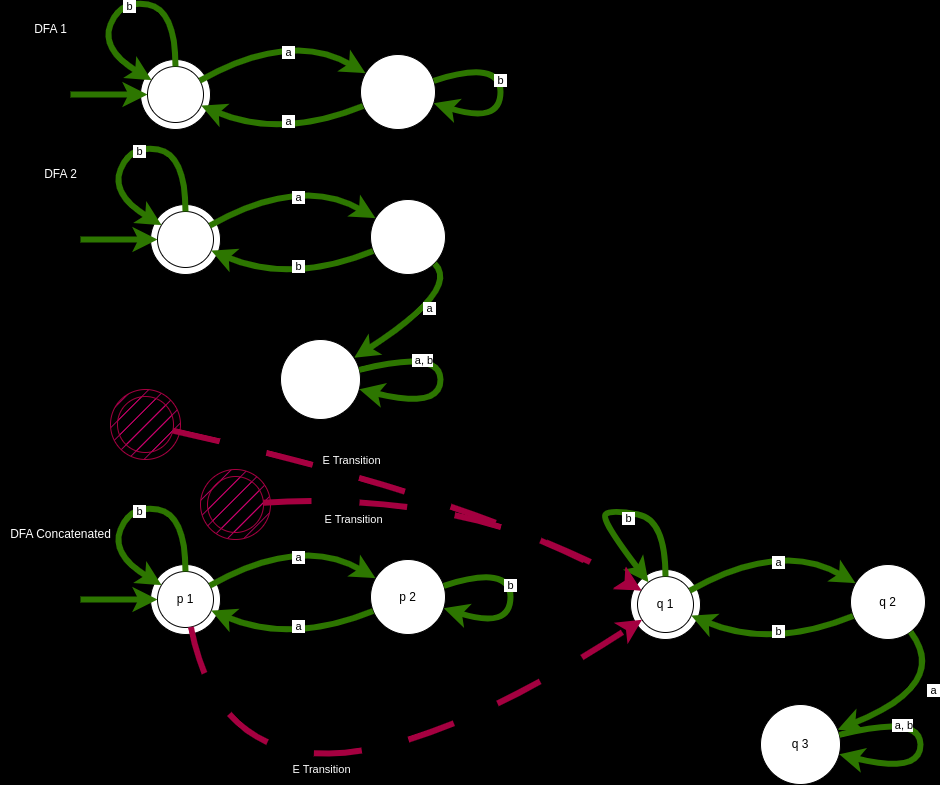

# 02/13/2024 CECS 329

## Homework Review

### Induction :

Prove every tree w/ n nodes has n-1 edges.

Proof:

    Let P(n) : Every tree with n nodes has n - 1 edges."

Base case: n = 1

    P(n) : Every with 1 node has 1 - 1 = 0 edges


Inductive Step:

    Suppose P(k) is true for all n ≥ k ≥ 1 . That is every tree with k nodes has k - 1 edges.

We want to show that P(k+1) is true.

Suppose that we have a tree with k + 1 nodes. Remove any node from this tree we dave one or many subtrees.




(... n<sub>k-1</sub>-1 edges, n<sub>k</sub>-1 edges) = (# of edges of the k + 1 node tree) - (# of edges removed as a result of removing one node)

### DFA

ababbbbbab

DFA<sub>1</sub>


 | ababbbbab
a | babbbbab
ab | abbbbab
aba | bbbbab
abab | bbbab
ababb | bbab
....

E - Transition You do not need any input to move to a different state

This machine, and it's DFA equivalent will recognize the same language.

DFA is not good at guessing where is it, you may need a lot of states, therefore we use this new machine
```
ababbbbbab
        P_1    P_1
a - - - |- - -  | - - - - - - 
        v       v
        P_2    Q_1
b - - - |- - -  | - - - - - - 
        v       v
        P_2    Q_1
a - - - |- - -  | - - - - - - 
        v       v
        P_1    Q_2     P_1
b - - - |- - -  |       |
        v       v       v
        P_1    Q_1     Q_1
b - - - |- - -  | - - - - - - 
        v       v

```
P_1 can go to Q_1 at any and all times 

## Non Deterministic Finite Automaton (NFA)


to be continued ...
