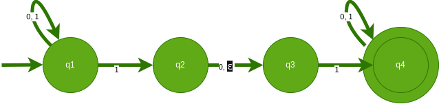
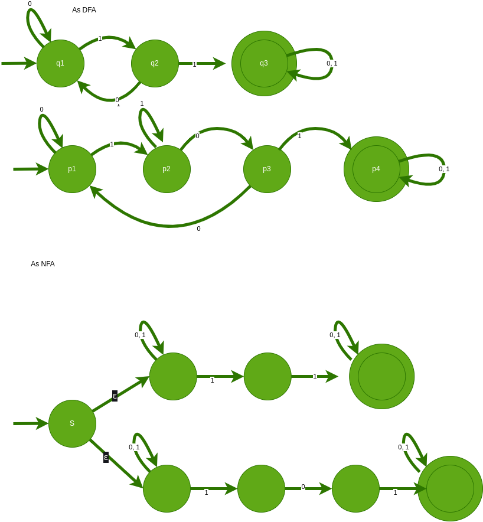

# CECS 329 01/25/2024

## Review

Remove one node from the tree and all the dges incedent tothis node. Let e ve the number of dges incident to this node. We then have created e subtrees. Let n1, n2, n..., ne be the number of nodes for each subtree.

Since we only remove one node, n1, n2, n..., ne <= k . By inductive hypothesis, 

n1 node tree has n1 - 1 edges.

n2 node tree has n2 - 1 edges

...

ne node tree has ne - 1 edges

\# of edges of k + 1  node tree - e = n1 - 1 + n2 - 1 + ... + ne - 1

\# of edges of k+ 1 node tree = ( n1 + n2 + ... + nr) + (-11 -12 ... -1e) + e

\# of edges of k + node tree = k

## Nondeterministic Finite Automaton 
N = ( Q, ∑, δ, q◦, F)
* Q = states
* ∑ = alphabet
* δ = Q x ∑ε -> P(Q)
    * ∑ u { ε } --> 
    * e transition
* q◦ = starting state
* F = accepting states

### example 1

* Q = { q1, q2, q3 , q4}
* ∑ = { 0, 1 }
* q◦ = q1
* F = { q4 }

* δ = 

| q/e          | 0                 | 1                                | ε                 |
|--------------|-------------------|----------------------------------|-------------------|
| q1| { q1 } | { q1, q2 } | ∅                 |
| q2| { q3 } | ∅                                | { q3 } |
| q3| ∅                 | { q4 }                | ∅                 |
| q4| { q4 } | { q4 }                | ∅                 |

L = { w | w starts iwth 1 or ends with 1 }

There are some strings that this machine do not recognize

### example 2

L = { w | w scontains subsctrin 11 or 101S }

